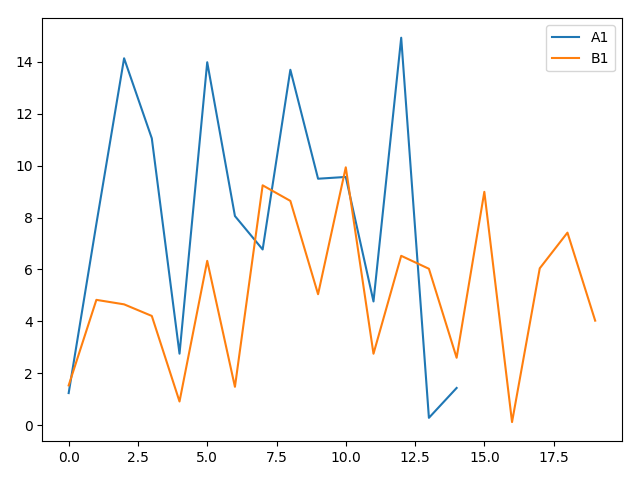

# Assignment 1: Statistical Tests

## 1 Exercise

```shell
python /mnt/files/repos/mo850/tasks/1-statistical-tests/small-data-set-1-non-paired.py with seed=42
p-value from t-test: 0.057238709334717516
p-value from Wilcoxon rank sum test: 0.06675301516963451
INFO - small-data-set-1-non-paired - Completed after 0:00:00
```



## 2 Exercise

```shell
python /mnt/files/repos/mo850/assignments/1-statistical-tests/small-data-set-2-paired.py with seed=42
p-value from paired t-test: 0.004650123707777353
p-value from t-test: 0.14024114461324605
p-value from Wilcoxon signed rank-test: 0.012515318690073973
p-value from Wilcoxon rank sums test: 0.18587673236587576
INFO - small-data-set-2-paired - Completed after 0:00:00
```
